# WIKI LOGICA
## Lógica de Sistemas

**Contenido**
* ### Proposiciones
* ### Operadores Lógicos
* ### Silogismos
* ### Inferencia
* ### Reglas de reemplazo
* ### Diagramas UML

#
## **PROPOSICIONES**
### En el lenguaje científico, se define como proposición a una sentencia o enunciado que puede ser verdadero o falso, generalmente son de carácter enunciativo. Una proposición o enunciado es una oración que puede ser falsa o verdadera, pero no ambas a la vez. La proposición se considera un elemento fundamental de la Lógica Matemática.

### Una proposición se compone de los siguientes factores:

### * **Premisas**:  Se le llama premisa a todas y cada una de las proposiciones de un razonamiento que dan la consecuencia o conclusión de dicho razonamiento. Las premisas se definen como expresiones lingüísticas que afirman o niegan algo y pueden ser verdaderas o falsas.

### * **Conclusión**: La conclusión será la proposición final que surge a partir de las premisas que forman el argumento o enunciado.  
#
### Ejemplos
* ### Está Soleado
* ### La tierra tiene agua
* ### El vaso es de vidrio 
* ### Está lleno el cine

#

## Clasificación de las proposiciones
### * **Proposiciones Simples**
### Son proposiciones que ya no pueden descomponerse en dos expresiones que sean proposiciones.

### Ejempos
* ### La ballena azul.
* ### Juan va a la escula.
* ### La pirámide más alta.

### * **Proposiciones Compuestas**
### Es una proposición formada por dos o más proposiciones simples o compuestas. En estas prociones se usan las partículas gramaticales no, o, y, si , entonces.

### Ejemplos
* ### Teresa va a la escuela o María es Inteligente
* ### 4 es menor que 8 o 6 es mayor que 10
* ### Si corro rápido entonces llegare temprano

#

## Las proposciones se dividen según su contenido

### **Cantidad**
* ### Universales: Una proposición es universal cuando se refiere a la totalidad de elementos involucrados en él. 
* ### Particulares: Las proposiciones particulares son las que se refieren únicamente a una parte del todo, siempre y cuando sea de dos en adelante. 
* ### Individuales: Son aquellas proposiciones que se refieren a un solo elemento del conjunto.

### **Cualidad**
* ### Afirmativas: Cuando las proposiciones o juicios expresan un concepto o conceptos que pertenece a otro u otros.
* ### Negativas: Cuando las proposiciones expresan que un concepto o conceptos no pertenece a otro u otros. Existe una separación total entre los conceptos enunciados.  
* ### Indeterminada: Se llaman indeterminadas porque no afirman ni niegan algo especifico.

### **Modalidad**
* ### Problemáticos: Dan una información cuya negación o afirmación es únicamente posible, es decir que puede ser 
* ### Asertoricos: Describen cosas reales, dan información de cómo son los elementos de las clases que describen.  
* ### Apodícticos: Establece una necesidad en la relación entre los conceptos. 

### **Relación**
* ### Categóricas: Son las proposiciones que enuncian la relación entre dos conceptos, es decir entre sujeto y predicad  
* ### Hipotéticas: La relación que se establece es tanto entre conceptos como entre proposiciones.   
* ### Disyuntivas: En estos juicios o proposiciones, la relación se da entre dos o mas proposiciones entre si, no de consecuencia sino de oposición lógica.

#
#

## **OPERADORES LOGICOS**
## Simbolos Conectivos
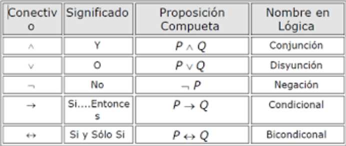

 #

 ### **Negacion**: Permite negar un enunciado o proposición atómica o una molecular. Llevan el adverbio de negación ‘no’, o sus expresiones equivalentes como “nunca”, “jamás”, “tampoco”, “no es verdad que”, “no es cierto que”, “es falso que”, “le falta”, “carece de”, “sin”, “imposible”, etc.
 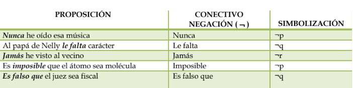
#

### **Conjuncion**: Enlaza proposiciones por el conectivo “y”, o sus expresiones equivalentes como “e”, “pero”, “aunque”, “aun cuando”, “tanto... como...”,”sino”, “ni...ni”, “sin embargo”, “además”, etc. Se representan simbólicamente al unir dos proposiciones atómicas como por ejemplo p y q;p no obstante q; p sin embargo q.
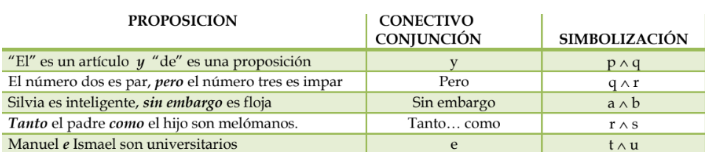
#

### **Disyuncion**: La conjunción disyuntiva “o”, y sus expresiones equivalentes como “u”, “ya... ya”, “bien...bien”, “ora... ora”, “sea... sea”, “y/o”, etc., son utilizadas para la disyunción y unión entre proposiciones atómicas. La disyunción “o” por su parte tiene dos sentidos: uno inclusivo o débil y otro exclusivo o fuerte.
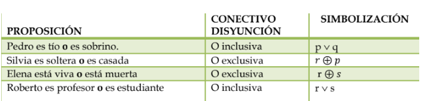
#

### **Condicional**: Es la forma enunciativa que simboliza enunciados enlazados por expresiones equivalentes como “si...entonces...”, “si”, “siempre que”, “con tal que”, “puesto que”, “ya que”, “porque”, “cuando”, “de”, “a menos que”, “a no ser que”, “salvo que”, “sólo si”, “solamente si”, “dado que” donde P es el antecedente y q el consecuente.
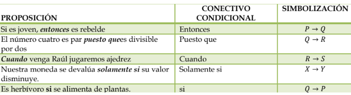
#

### **Bicondicional**: Simboliza enunciados de forma “... sí y sólo si...”, o sus expresiones equivalentes como “cuando y sólo cuando”, “si..., entonces y sólo entonces...”, “es equivalente a” etc.
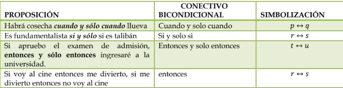

#
#

## **SILOGISMOS**
## Los silogimos constan de tres proposiciones
* ### Una premisa mayor
* ### Una premisa menor
* ### Una conclusion
#

### El término **predicado**, de la conclusión es llamado el **"término mayor"**
### El término **sujeto**, de la conclusión es llamado el **"término menor"**
### El tercer término del silogismo, que no aparece en la conclusión, pero aparece en cambio en las dos premisas, es llamado el **"término medio"**

### **Ejemplo**
* ### Ningún héroe es cobarde.
* ### Algunos soldados son cobardes.
* ### Por lo tanto, algunos soldados no son héroes.

### "soldado" término menor, "héreo" término mayor, "cobarde" término medio.
#

### **Modo de un silogismo**
### El modo de un silogismo se determina por las formas y el orden  de las proposiciones  que contienen. 

### **A =** TODO (S)__ ES(son)__
### **E =** NINGUN (NOS)__ ES(son)__
### **I =** ALGUN (NOS)__ ES(son)__
### **O =** ALGUNO (S)__ NO ES(no son)__
## Ejemplo
### *NINGUN* HEROE *ES* COBARDE.
### *ALGUNOS* SOLDADOS  *SON* COBARDES.
### POR LO TANTO, *ALGUNOS* SOLDADOS *NO SON* HEROES.

### El modo es: **E I O**
#
### **Forma de un silogismo**
### La forma o “ esqueletos “ de los silogismos se puede  anotar  en forma  abreviada, reemplazando los términos menores  por S, los términos mayores  por P, y los términos medios por M. 
 
### 1.  M-P, S-M, por lo tanto S-P
### 2. P-M, S-M, por lo tanto S-P
### 3. M-P, M-S, por lo tanto S-P
### 4. P-M, M-S,  por lo tanto S-P
#

### **Leyes del silogismo**
* ###  Para los términos
1. ### Todo silogimo tiene tres términos. El mayor, medio y menor.
2. ### Los términos no pueden tener mayor extensión en la conclusión que en las premisas.
3. ### El término medio no puede estar en la conclusión.
4. ### El término medio	tiene que estar distribuído al menos un vez.

* ### Para las proposiciones
1. ### De premisas afirmativas no se puede inferir una conclusión negativa.
2. ### De dos premisas negativas no se puede inferir.
3. ### La conclusión debe seguir la parte más débil.
4. ### De dos premisas particulares nada se concluye.
#
#

## **INFERENCIA**
### Es una operación lógica que se efectúa en el razonamiento, la cual consiste en derivar o inducir una conclusión a partir de una o varias premisas. Se pueden clasificar de acuerdo al numero de premisas que contenga el razonamiento. Así cuando solo existe una premisa, entonces se le llama inferencia inmediata y cuando parten de dos o mas premisas, se les conoce como inferencia mediatas, pues entre una premisa y la conclusión, existe otra u otras que la mediatizan.

### Ejemplo:
### * Un numero racional es positivo si, y solo si no es negativo. Ningún numero es racional negativo es primo. Por lo tanto, todo numero primo es racional positivo.
#

## **Reglas de Inferencia**

### MODUS PONENDO PONENS
### Esta regla indica que dos proposiciones de la forma ( p => q y p, se puede deducir q.)  Esta regla se aplica a la forma de las proposiciones, no importa el contenido de p o de q, ya que si tenemos una proposición condicional (p => q) y su antecedente (p)  sucede, entonces sobreviene el consecuente (q).  Tanto p como q pueden ser proposiciones moleculares o compuestas. 
* ### Premisa 1: Si hoy no es Sábado, entonces mañana no es domingo
* ### Premisa 2: Hoy no es sábado
* ### Conclusión: Mañana no es domingo
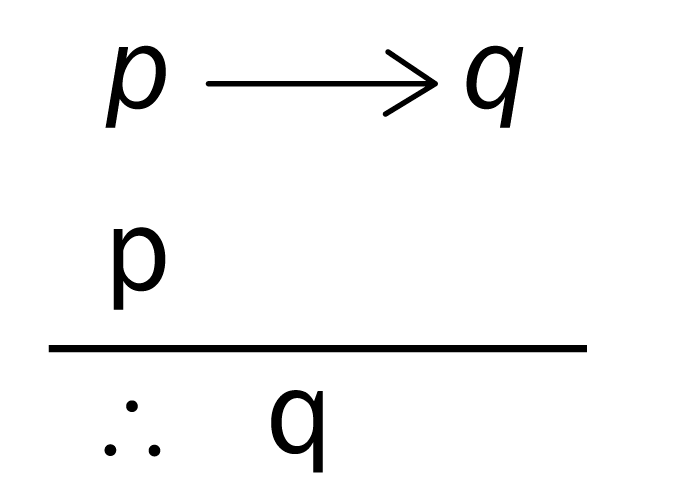
#
### MODUS TOLLENDO TOLLENS
### Esta regla permite pasas a dos premisas (1), una premisa condicional y (2)  una proposición que niega el consecuente, a una conclusión donde le antecedente queda negado. Tanto el antecedente como el consecuente pueden ser proposiciones simples o compuestas.
* ### Premisa 1: Si me pagan voy al puerto
 * ### Premisa 2: No voy al puerto
 * ### Conclusión: No me pagan
 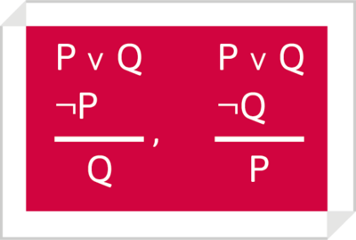
 #

 ### DOBLE NEGACION
 ### Son las inferencias que si A es verdad, entonces no no-A es verdad y su conversión, que, si no no-A es verdad, entonces A es verdad 
 * ### No es cierto que Carlos no tiene novia.
 ### La conclusión que podemos obtener es: Carlos tiene novia.
 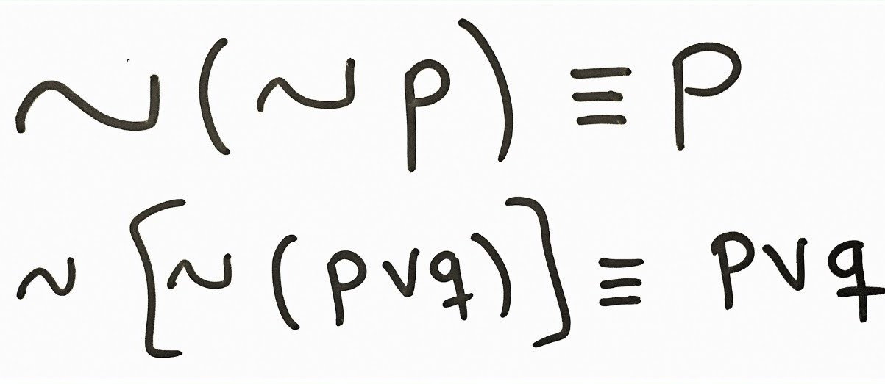
 #
 ### SILOGISMO HIPOTETICO
 ### Podemos decir que, si una causa sigue una consecuencia y esta consecuencia a su vez causa una segunda consecuencia, se puede decir que, esa primera causa es causa de la segunda consecuencia. 
 * ### Si estudias lógica(**P**) entonces podrás evaluar argumentos(**Q**).
 * ### Si pueden evaluar argumentos(**Q**) entonces puedes debatir(**R**).
 * ### Si estudias lógica(**P**) entonces puede debatir(**R**).
 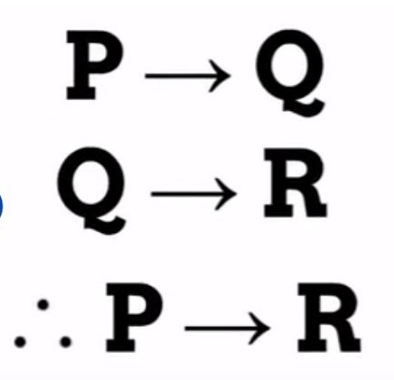
 #

 ### SIMPLIFICACION DISYUNTIVA
 ### Nos permite pasar de dos premisas a la conclusión, esta regla se aplica siempre que se dé una proposición condicional y se dé precisamente el consecuente  
 * ### Me levanto temprano(**p**) o me levanto tarde(**q**)
 * ### Si me levanto temprano(**p**) entonces comeré(**r**)
 * ### Si me levanto tarde(**q**) entonces comeré(**r**)
 * ### Comeré(**r**)
 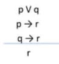
#
#

## **REGLAS DE REEMPLAZO**
### **Leyes de Morgan**
### La negacion de:
* ### El gato gruñó y el perro ladró
* ### El gato no gruñó o el perro no ladró
### **¬(p Λ q)**
### **¬p V ¬q**
#
### La negación de: 
* ### Juan llegó o María salió
* ### Juan no llegó y María no salió
### **¬(p V q)**
### **¬(p V q)**
#

### **Doble Negación**
* ### No ocurre que Ana no es una estudiante ¬¬p 
* ### Entonces Ana es estudiate p
### **¬¬p**
### **p**
#

### **Conmutación de la disyunción**
* ### Es lunes o es martes p v q 
* ### Luego es martes o lunes q v p
### **p v q**
### **q v p**
#

### **Asociativa de la Conjunción**
* ### Hay clases el lunes, miercoles y viernes  [A /\ (B /\ C)]
* ### Entonces hay clases el lunes y el miércoles y el viernes [(A /\ B) /\ C]
### **[A /\ (B /\ C)]**
### **[(A /\ B) /\ C]**
#

### **Distruibuiva de la Conjunción**
* ### [A /\ (B \ / C)]
* ### [(A /\ B) \ / (A /\ C)]
#

### **Transposición**
* ### Si 6 es múltiplo de 3, entonces es divisible dentro de 3    (A → B) 
* ### luego si 7 no es múltiplo de 3 entonces 7 no es divisible dentro de 3   (¬B → ¬A)

### **(A → B)**
### **(¬B → ¬A)**
#

### **Implicador**
### Afirma que es equivalente afirmar que "si p es verdad, entonces q también debe ser verdad", y decir que "o p no es verdad, o q debe ser verdad". 
* ### Una implicación es verdadera cuando p es falsa o cuando q es verdadera
### **A → B**
### **¬A \ / B**
#

### **Equivalencias**
### Equivalencia 1
### Dice que dos proposiciones son equivalentes se a implica a b y b implica a a
### **A ↔ B**
### **[(A → B) /\ (B → A)]**
### Equivalencia 2
### Dos propociones son equivalentes si la primera y la segunda son diferentes a la negación de la primera y la negación de la segunda.
### **A ↔ B**
### **[(A /\ B) \ / (¬A /\ ¬B)]**
#

### **Exportación**
### De una conjunción podemos implicar otra proposición
* ### Estudias y haces las tareas entonces ganaras el grado luego si estudias entonces haces tus taras y entonces ganaras el grado

### **[(A /\ B) → C]**
### **[A → (B → C)]**

#
#

## **DIAGRAMAS UML**
### UML (Lenguaje de modelado unificado), es una forma de representar procesos y soluciones de una manera gráfica. UML es el lenguaje estandarizado que se utiliza internacionalmente, consta al menos de 9 diagramas representados en diferentes vistas.
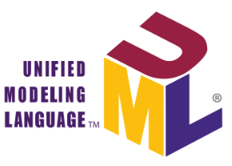

### **Estos diagrama se dividen en**
* ### Diagramas de Estructura
* ### Diagramas de Comportamiento
#

### Diagramas de Estructura
* ### **Diagramas de Clases**: Los diagramas de clase son, sin duda, el tipo de diagrama UML más utilizado. Es el bloque de construcción principal de cualquier solución orientada a objetos. Muestra las clases en un sistema, atributos y operaciones de cada clase y la relación entre cada clase.
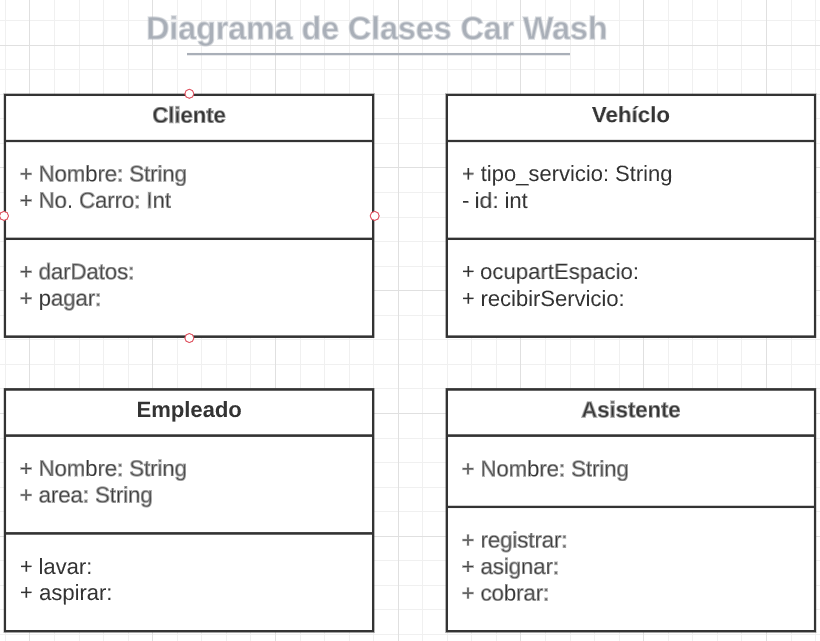
#
* ### **Diagramas de Componentes**: Un diagrama de componentes muestra la relación estructural de los componentes de un sistema de software. Estos se utilizan principalmente cuando se trabaja con sistemas complejos que tienen muchos componentes. Los componentes se comunican entre sí mediante interfaces. Las interfaces se enlazan mediante conectores.
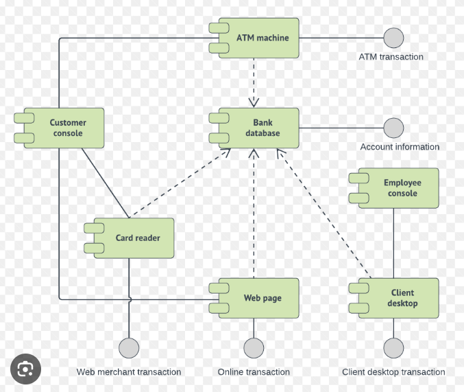 
#

### Diagramas de Comportamiento 
* ### **Diagrama de Casos de Uso**: Como el tipo de diagrama UML más conocido, los diagramas de casos de uso ofrecen una visión general de los actores involucrados en un sistema, las diferentes funciones que necesitan esos actores y cómo interactúan estas diferentes funciones. Es un gran punto de partida para cualquier discusión del proyecto, ya que se pueden identificar fácilmente los principales actores involucrados y procesos del sistema. 
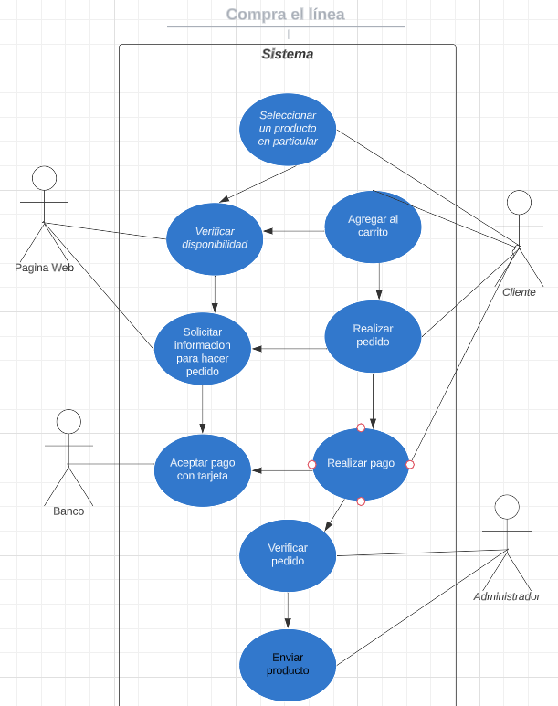
#

* ### **Diagrama de secuencia**: Los diagramas de secuencia en UML muestran cómo los objetos interactúan entre sí y el orden en que se producen esas interacciones. Es importante tener en cuenta que muestran las interacciones para un escenario en particular. Los procesos se representan verticalmente y las interacciones se muestran como flechas. Los diagramas de secuencia de UML forman parte de un modelo UML y solo existen dentro de los proyectos de modelado UML. 
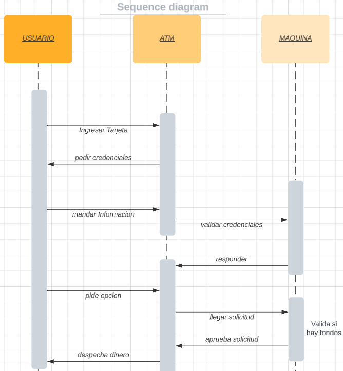

